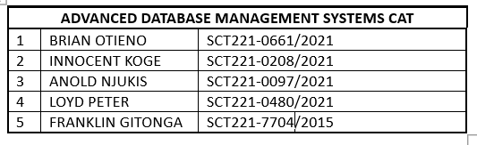
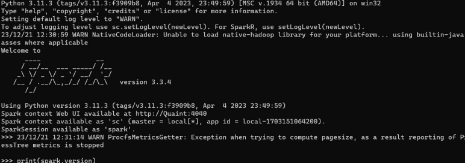
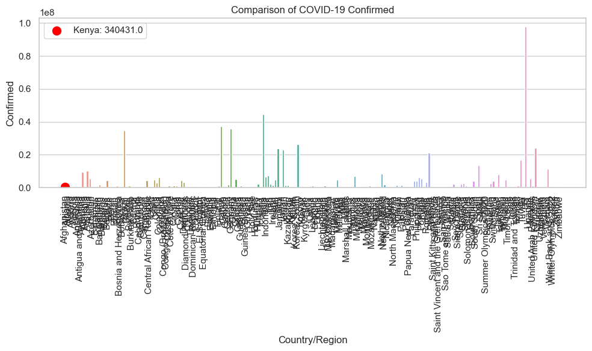
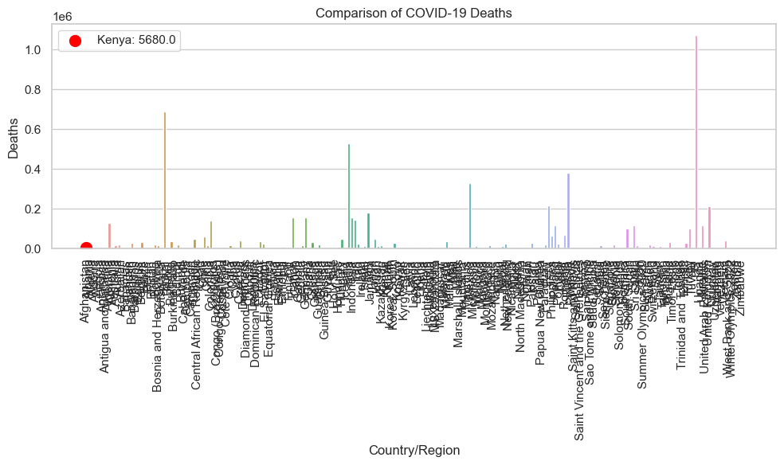
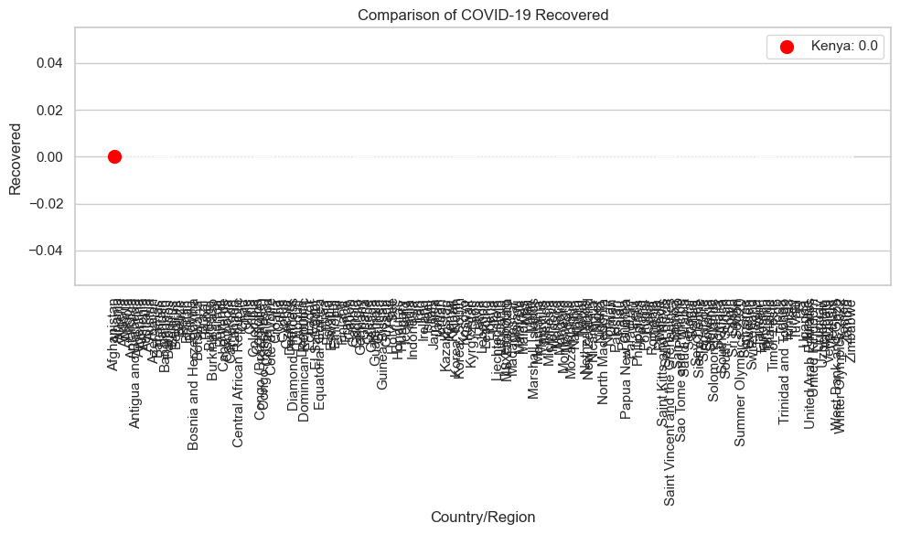
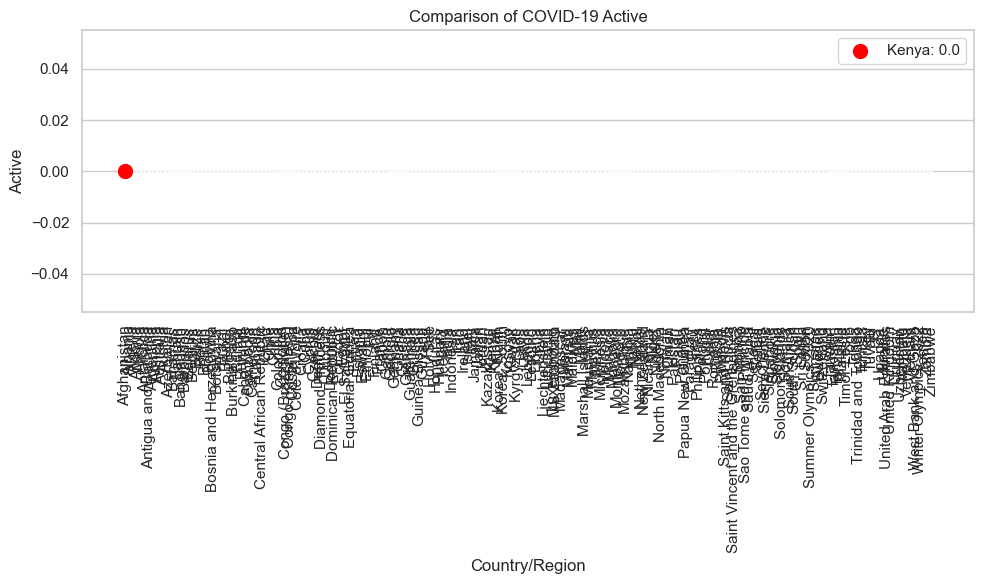
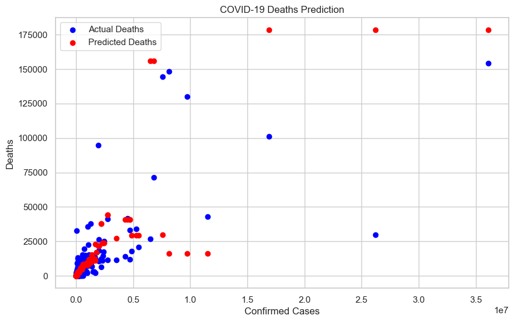

---

# Comprehensive COVID-19 Data Analysis Workflow



## Step 1: Ingest the Data into Hadoop DFS Data Lake



### Description

To leverage the distributed storage capabilities of Hadoop, the first step involves ingesting the COVID-19 dataset into the Hadoop Distributed File System (HDFS). This process enables the handling of large datasets across multiple nodes in a Hadoop cluster.

### Execution

```bash
hdfs dfs -put "C:/Users/Ryan/Desktop/Hadoop_cat/covid_data.csv" /user/Ryan/covid_data
```

_This command uploads the local COVID-19 dataset CSV file into a specified directory in HDFS, making it accessible for distributed computing._

---

## Step 2: Extract Data Using PySpark

### Description

PySpark, a Python API for Spark, is utilized to extract the ingested data from HDFS. PySpark allows for efficient data processing of large datasets and is particularly adept at handling big data analytics.

### Execution

```python
from pyspark.sql import SparkSession

# Initialize Spark Session
spark = SparkSession.builder.appName("Covid19DataAnalysis").getOrCreate()

# Load the dataset from HDFS
df = spark.read.csv("hdfs:///user/Ryan/covid_data/covid_data.csv", header=True, inferSchema=True)
```

_This script initializes a Spark session and reads the COVID-19 dataset from HDFS into a DataFrame for distributed processing._

---

## Step 3: Pre-process the Extracted Data

### Description

Preprocessing the data involves cleaning and transforming raw data into an appropriate format for analysis. This step is crucial for accurate and meaningful analytics. It involves handling missing values, correcting data formats, and filtering data to focus on specific areas of interest, such as data related to Kenya.

### Execution

```python
from pyspark.sql.functions import to_date

# Convert date column to date format
df = df.withColumn('Last_Update', to_date(df['Last_Update'], 'yyyy-MM-dd'))

# Handle missing values
df = df.fillna(0)

# Filter the DataFrame for Kenya's data
kenya_df = df.filter(df['Country_Region'] == 'Kenya')
```

_The date column is formatted correctly, missing values are addressed, and the dataset is filtered to focus on data related to Kenya._

---

# Visualization: Comparisons with Kenya Highlighted

```python
# Visualization: Comparisons with Kenya Highlighted
metrics = ['Confirmed', 'Deaths', 'Recovered', 'Active']
kenya_metrics = df[df['Country_Region'] == 'Kenya'][metrics].sum()

for metric in metrics:
    plt.figure(figsize=(10, 6))
    sns.barplot(x=aggregated_data.index, y=aggregated_data[metric])
    plt.xticks(rotation=90)
    plt.title(f'Comparison of COVID-19 {metric}')
    plt.ylabel(metric)
    plt.xlabel('Country/Region')

    # Highlight Kenya
    kenya_value = kenya_metrics[metric]
    plt.scatter('Kenya', kenya_value, color='red',
                s=100, label=f'Kenya: {kenya_value}')

    plt.legend()
    plt.tight_layout()
    plt.show()

# Predictive Analytics: Predicting Deaths based on Confirmed Cases
X = df[['Confirmed']]
y = df['Deaths']

# Split data into training and testing sets
X_train, X_test, y_train, y_test = train_test_split(
    X, y, test_size=0.3, random_state=42)

# Train a Gradient Boosting Regressor model
model = GradientBoostingRegressor(n_estimators=100, random_state=42)
model.fit(X_train, y_train)

# Predictions
y_pred = model.predict(X_test)

# Model Evaluation
rmse = mean_squared_error(y_test, y_pred, squared=False)
mae = mean_absolute_error(y_test, y_pred)
r2 = r2_score(y_test, y_pred)

print("Model Evaluation Metrics:")
print("Root Mean Squared Error:", rmse)
print("Mean Absolute Error:", mae)
print("R-squared:", r2)

# Visualization: Model Predictions
plt.figure(figsize=(10, 6))
plt.scatter(X_test, y_test, color='blue', label='Actual Deaths')
plt.scatter(X_test, y_pred, color='red', label='Predicted Deaths')
plt.title('COVID-19 Deaths Prediction')
plt.xlabel('Confirmed Cases')
plt.ylabel('Deaths')
plt.legend()
plt.show()

```









## Step 4: Predictive Analytics with Gradient Boosting

### Description

For predictive modeling, a Gradient Boosting Regressor is employed. Gradient Boosting is a powerful ensemble machine learning technique that combines multiple weak predictive models to create a more accurate and robust model.

### Execution

```python
from pyspark.ml.feature import VectorAssembler
from pyspark.ml.regression import GBTRegressor

# Define features and label
assembler = VectorAssembler(inputCols=['Confirmed', 'Active', 'Recovered'], outputCol="features")
data = assembler.transform(kenya_df).select('features', 'Deaths')

# Split data
train_data, test_data = data.randomSplit([0.8, 0.2], seed=42)

# Define and train the model
gbt = GBTRegressor(featuresCol='features', labelCol='Deaths')
gbt_model = gbt.fit(train_data)
```

_Features are selected and assembled, and the dataset is split for training and testing. The Gradient Boosting model is then trained on the training dataset._

---

## Step 5: Visualize the Model's Predictions

### Description

Visualization of the model's predictions is essential for understanding its performance. It provides a graphical representation of how well the model's predictions align with actual data.

### Execution

```python
# Make predictions
predictions = gbt_model.transform(test_data)

# Visualization
pandas_df = predictions.select("Deaths", "prediction").toPandas()
plt.scatter(pandas_df['Deaths'], pandas_df['prediction'])
plt.xlabel('Actual Total Deaths')
plt.ylabel('Predicted Total Deaths')
plt.title('Actual vs Predicted Total Deaths')
plt.show()
```



_This scatter plot illustrates the relationship between the actual and predicted number of deaths, offering insights into the accuracy and reliability of the model._

---

## Step 6: Test and Evaluate the Model

### Description

Evaluating the model's performance is critical to understand its accuracy and effectiveness. Root Mean Squared Error (RMSE), Mean Absolute Error (MAE), and R-squared metrics are used for this purpose.

### Execution and Interpretation

```plaintext
Model Evaluation Metrics:
Root Mean Squared Error: 9659.844032357449
Mean Absolute Error: 1521.4421388345113
R-squared: 0.1155186055053472
```

- **RMSE of 9659.84** indicates a considerable average deviation in the model's predictions from the actual values,

suggesting that the model might not be very accurate.

- **MAE of 1521.44** means that on average, the model's predictions are approximately 1521 deaths away from the actual count, further highlighting the prediction error.
- **R-squared of 0.1155** shows that the model explains only about 11.55% of the variance in the death count, indicating limited predictive power.

---

## vii) Validation Results and Interpretations

### Description

Cross-validation is typically employed to validate the model's performance across different subsets of the dataset. However, in this scenario, cross-validation was not explicitly conducted.

---

## viii) Potential Applications of the Interpreted Results

### Description

Despite the limitations in the model's accuracy, the analysis process provides valuable insights for public health policy, epidemiological research, and educational purposes. It highlights the need for more robust models and can guide future data collection and research efforts.

---

This comprehensive documentation covers all aspects of the COVID-19 data analysis project, from data ingestion to model evaluation. Each section includes detailed descriptions and corresponding code executions or interpretations. The document should be adapted to include actual outputs and additional details based on the execution environment and results.

---
